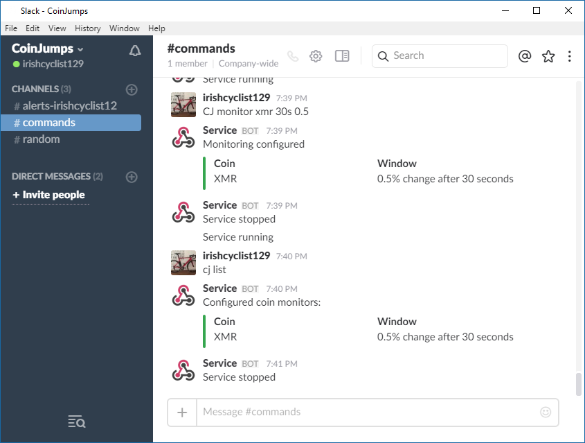
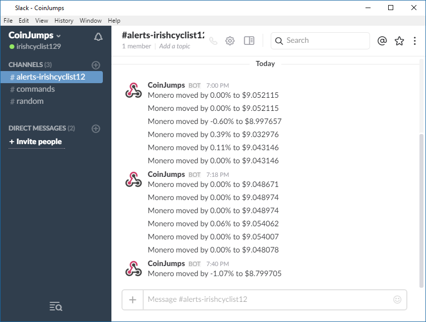
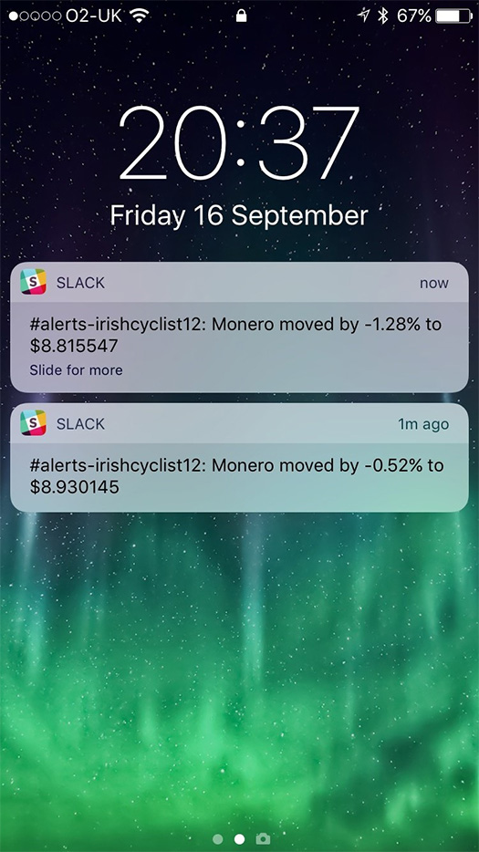

# CoinJumps
Simple Windows Service for monitoring movements in crypto currency prices that publishes messages to a Slack channel.

## How it works

The Windows Service opens a [Socket IO](https://github.com/Quobject/SocketIoClientDotNet) connection to the [CoinCap api](https://github.com/CoinCapDev/CoinCap.io) and receives notifications of changes to crypto currency prices.
You the user send text commands to the service to request notification of a price movement outside of a specified limit and the service will notify you via a [Slack webhook](https://github.com/nerdfury/Slack.Webhooks) when this occurs.

## Development dependencies

* .Net Framework 4.6.1
* Visual Studio 2015 - C# 6
* A slack team for testing (create one for free at [slack.com](https://slack.com/))
* Open TCP port 144 (more on this below)

## Usage guide

The Slack team should have channel called **#commands** and you will need to make another in the format **alerts-** followed by your username.   Don't worry if your username is too long and gets truncated it should still work.   Commands with the exception of 'Restart' will only apply to you, so your friends in the same team will not be affected by your comamnds.

Suggested settings for Slack:
* _Disable_ push notifications for the **commands** channel.
* _Enable_ push notifications for _your_ **alerts-....** channel.

All commands start with the initials **CJ**.

### Creating a price alert

`CJ Monitor XMR 5m 0.5`

The above requests a price notification for the XMR currency (Monero) if the price moves more than half a percent +/- over a period of five minutes.

### Adjusting the threshold

Re-issue a command for the same currency and window with a different threshold will replace the previous one.

`CJ Monitor XMR 5m 1`

The above adjusts the previous notification so that the threshold is now one percent over five minutes.

When getting started try setting the threshold low (even zero) to see how the notifications work.

### Pausing alerts

Issue the following command to stop receiving notifications without removing your configured monitoring

`CJ Pause`

To resume:

`CJ Resume`

### Clearing a notification for a particular window

`CJ Monitor XMR 5m x`

Note the 'x' as the threshold here.  This tells the system to remove the monitoring for the five minute window.

### Clear all alerts for a particular currency

`CJ Clear XMR`

### Clear all alerts

`CJ Clear`

### Other commands

`CJ Status`

`CJ List`

`CJ Restart`

## Notification examples

## Slack configuration

To allow the service to send Slack messages you will need to create both an _incoming_ webhook and an _outgoing_ webhook - this can be done on the slack website at: https:// [teamname] .slack.com/apps/build/custom-integration

You will need to copy/paste the incoming **Webhook URL** into the project's **app.config** file.

The outgoing webhook should be configured as follows

**Channel** #commands  
**Trigger Word(s)** leave this blank  
**URL(s)** set this to your public IP address port 144  i.e.  http://6.23.4.76:144  
_customise the remaining properties as you wish_  

Ensure that port 144 is forwarded on your router and unblocked in your firewall.

**Be careful not to breach the Slack Terms of Service - especially if you set multiple monitors with short windows - you use this software at your own risk.**
